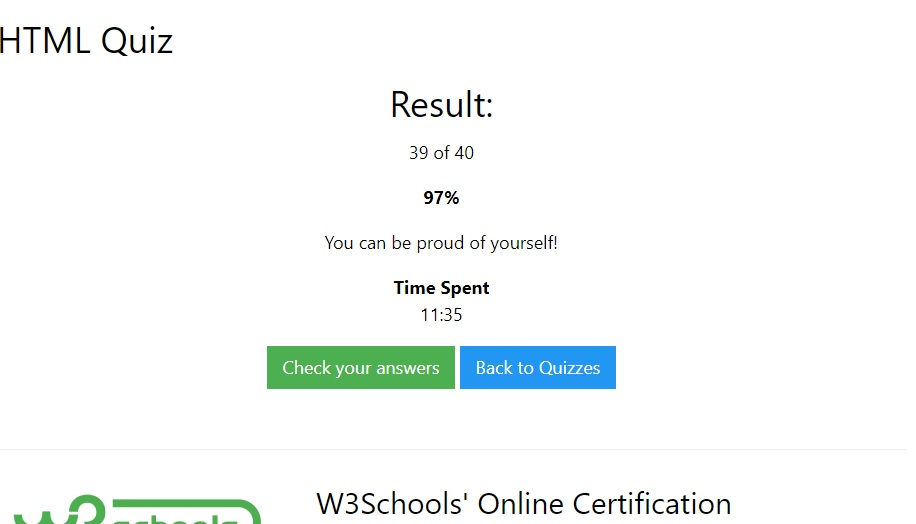
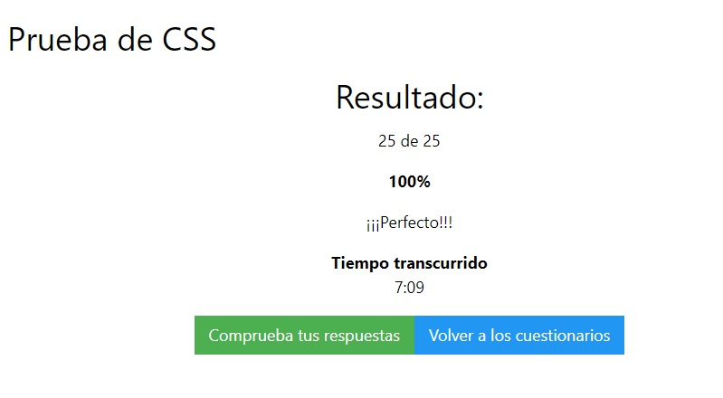
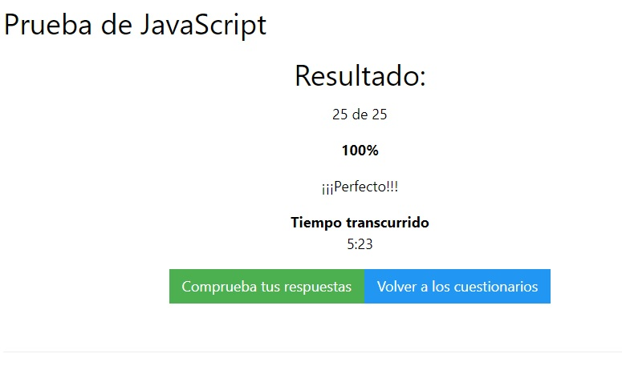

<!-- # BIENVENIDOS
## Graficación y animación  -->
###Evaluación
Evaluación
Primero se realizo una evaluacion sobre los temas de html, css, js

En la cual te da una serie de preguntas básicas y dependiendo de tu nivel te arroja un resultado. En mi caso me salio mas alto el js. Aqui te dejo los link y cuentame que tema tuviste la mayor puntuación. Estare respondiendo sus comentarios.

Los siguientes link:

[HTML.-](https://www.w3schools.com/html/html_quiz.asp)

[CSS.-](https://www.w3schools.com/css/css_quiz.asp)

[JS.-](https://www.w3schools.com/js/js_quiz.asp)

