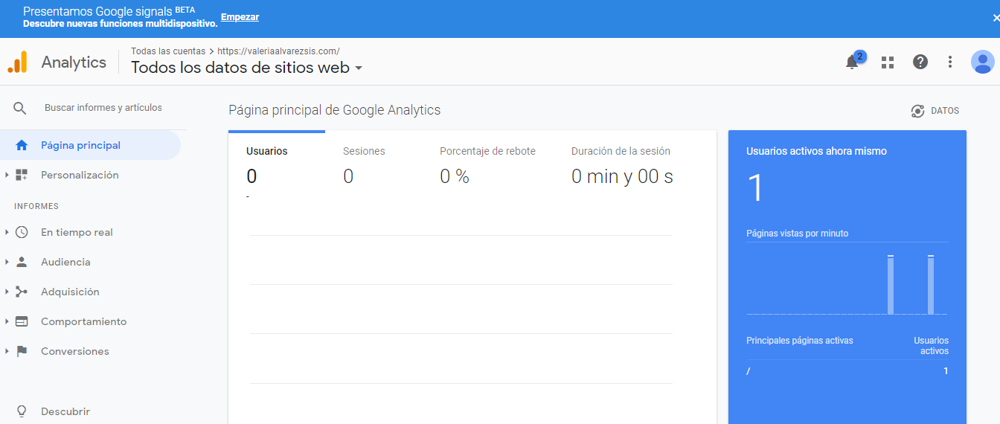

<!-- # BIENVENIDOS
## Graficación y animación  -->
###Google Analytics
Google Analytics es utilizada para monitorear el estado de un sitio web,básicamente se trata de un servicio de análisis web con el que puedes obtenerdiferentes tipos de información de un sitio, como su número de visitantes o latasa de conversiones, por ejemplo,todos ellos en tiempo real. Funciones que nos ofrece para conocer mejor a nuestros usuarios son: Saber lo que les gusta y lo que no. Su procedencia geográfica. Dispositivo utilizado: Smartphone, Tablet. Cómo nos encontraron en la red. Por dónde se van de nuestra web. Que les gusta y que no de lo que ofrecemos.Para poder usar se debe poner el codigo que muestra la pagina de google analytics y creamos una cuenta con los datos de nuestra página web y listo.

Pruebalo es gratis aqui les dejo el link:
[Click aqui](https://analytics.google.com/analytics/web/?authuser=0#/provision/SignUp)
  
<!-- Global site tag (gtag.js) - Google Analytics -->

